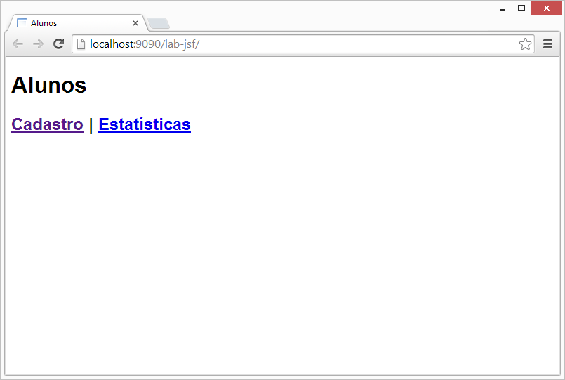

# lab-jsf

Laboratório para demonstrações e testes com Java Server Faces.

## Screenshots

### Tela principal da aplicação.

## Pendências

- [x] ~~Configurar o Maven na aplicação.~~
- [ ] Criar funcionalidade "Estatísticas".
- [ ] Reutilizar fragmentos de páginas ("include" de partes comuns). Ver ["JSF 2 Templating With Facelets Example"](http://www.mkyong.com/jsf2/jsf-2-templating-with-facelets-example/).
- [ ] Colocar uma confirmação antes de excluir um item na lista.
- [ ] Colocar o Derby para iniciar com a aplicação.
